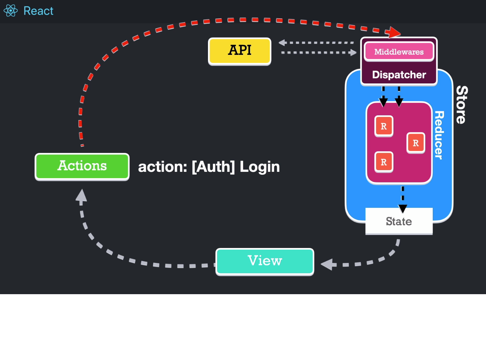
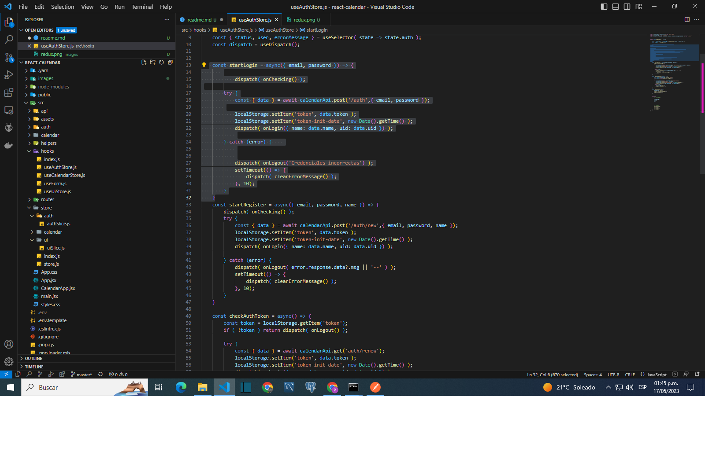
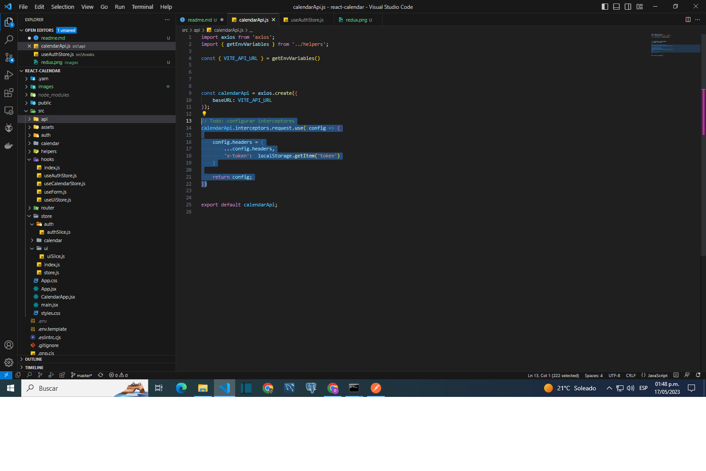
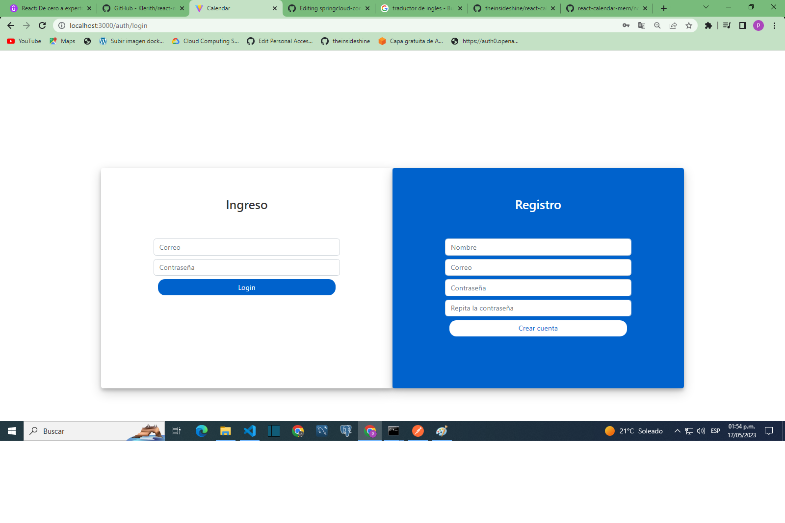
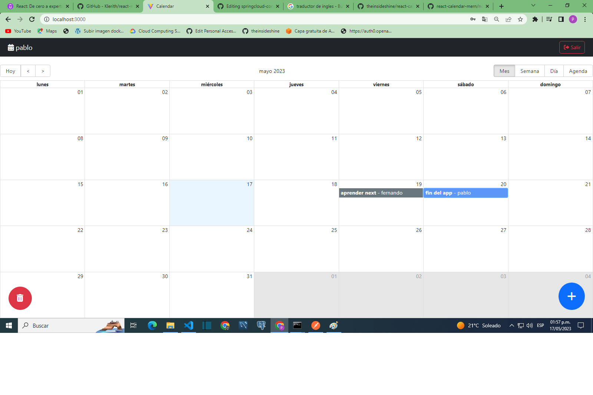
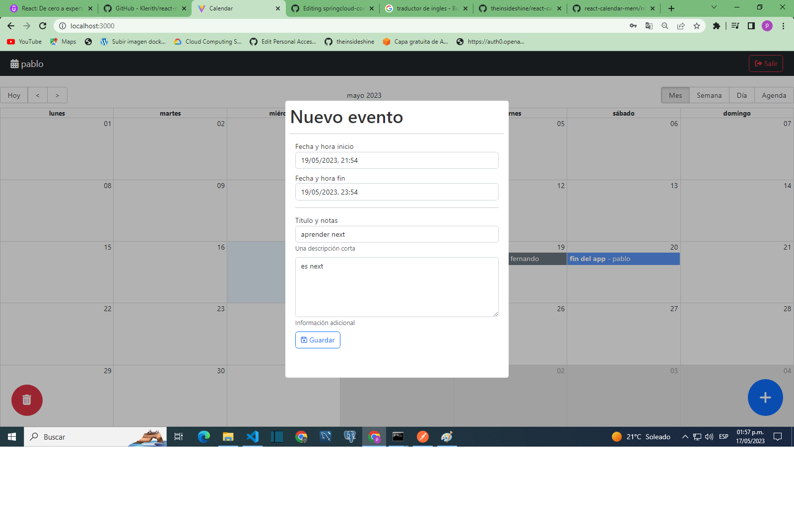
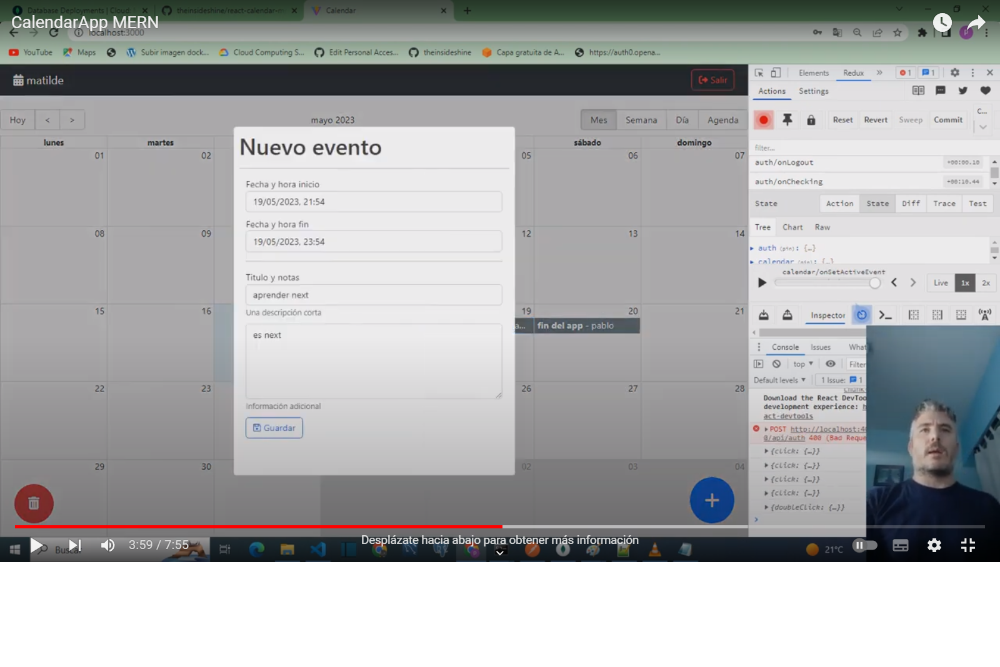

#Calendar APP

The intention of this project is to become familiar with the use of technologies such as nodejs, mongoDB and express, a course by Fernando Herrera was followed, this application is made in react.

Basically each registered user can create, edit, delete their notes and view the notes of other users in the calendar.

The redux pattern was used to maintain the states of the application

It was decided not to dispatch asynchronous tasks with the use of thunk, asynchronous requests are made within the reducers.

Axios and its interceptors were used to manage the token

Login screen

Calendar screen 

Modal 

Deploy the application locally.

Video-Demo CalendarApp

backend repository: https://github.com/theinsideshine/nodeJs-calendar

#Development steps

1. Rename the .env.template file to .env
2. Make the respective changes in the environment variables

VITE_API_URL=http://localhost:4000/api